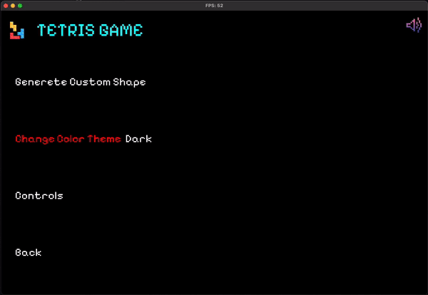

# My 211 Project: Tetris Game



## About

-   **Project Creation Date:** 2023-12
-   **Author:** Ulaş Can Demirbağ
-   **Student ID:** -------
-   **Email:** [ulascan.demirbag@std.yeditepe.edu.tr](mailto:ulascan.demirbag@std.yeditepe.edu.tr)
-   **GitHub:** [ulascan54](https://github.com/ulascan54)

This README file provides information on how to compile and run the Tetris game, along with attributions and resources used in the project.

**This project is created for the CSE 211 Data Structure Term project.**

## Game Description

Tetris is a tile-matching puzzle video game originally designed and programmed by Soviet Russian game designer Alexey Pajitnov. The first playable version was completed on June 6, 1984, while he was working for the Dorodnitsyn Computing Centre of the Academy of Science of the Soviet Union in Moscow. He derived its name from the Greek numerical prefix tetra- (all of the game's pieces contain four segments) and tennis, Pajitnov's favorite sport.

## Project Structure

- `bin` folder contains the executable file.
- `lib` folder contains the object files and the SFML library files.
- `include` folder contains the header files.
- `src` folder contains the source code files.
- `images` folder contains the images used in the game.
- `sounds` folder contains the music used in the game.
- `font` folder contains the fonts used in the game.
- `Makefile` is used to compile the project.
- `readme.md` is the readme file.
- `high_scores.txt` is the file that stores the highscores.

## Requirements

- SFML library must be installed. Refer to the SFML documentation for installation instructions: [SFML Download and Installation](https://www.sfml-dev.org/download.php)
- macOS Apple Silicon Chip System (ARM 64) M1, M2 **Recommended**
- Linux x86_64
- Windows x86_64

## SFML Requirements

- SFML 2.5.1
- GCC 9.3.0
- minGW w64
- Make 4.3
- Clang 12.0.0
- Xcode 12.5.1
- CMake 3.22.5

#### Dependencies

- freetype
- x11
- xrandr
- udev
- opengl
- flac
- ogg
- vorbis
- vorbisenc
- vorbisfile
- openal
- pthread

## SFML Installation

- [Genaral Guide](https://www.sfml-dev.org/download/sfml/2.6.1/)
- [Guide for macOS](https://www.sfml-dev.org/tutorials/2.5/start-osx.php)
- [Guide for Linux](https://www.sfml-dev.org/tutorials/2.5/start-linux.php)
- [Explanation Video](https://www.youtube.com/watch?v=85gzymHUmGI&t=509s&ab_channel=MikeShah)

## Compilation and Execution Steps

**I also added CMakeLists.txt file for cmake users.**

## **For CMake Users:**
### MacOS & Linux
   ```bash
      cmake -S . -B build -DCMAKE_BUILD_TYPE=Release
      cmake --build build
      cd build
      make
      ./build/bin/cmake-tetris
   ```

### Windows
   ```bash
      cmake -S . -B build
      cmake --build build --config Release
      cd build
      make
      ./build/bin/cmake-tetris.exe
   ```

- **You can find more details in this readme.md.**
- [CMakeLists.txt Run Details](https://github.com/SFML/cmake-sfml-project/blob/master/README.md)

## **For Makefile Users:**
- **Succestion: Run this game Development Mode**
- if you want to run this game correctly you must run this game in development mode.

### macOS

1. **Development Mode (Compile Everything to lib):**
   In development mode, it will compile everything in this project:

   To compile, use the following command:

   ```bash
   make m
   ```

   This command will compile only necessary files in the `lib` folder.

2. **Run:**

   If you want to run the game, use the following command:

   ```bash
   make run-m
   ```

   or

   ```bash
   ./bin/app-m
   ```

### Linux

1. **Fast Play:**

1. **Development Mode (Compile Everything to lib):**
   In development mode, it will compile everything in this project:

   To compile, use the following command:

   ```bash
   make l
   ```

   This command will compile only necessary files in the `lib` folder.

1. **Run:**

   If you want to run the game, use the following command:

   ```bash
   make run-l
   ```

   or

   ```bash
   ./bin/app-l
   ```

### Wındows

1. **Fast Play:**

1. **Development Mode (Compile Everything to lib):**
   In development mode, it will compile everything in this project:

   To compile, use the following command:

   ```bash
   make w
   ```

   This command will compile only necessary files in the `lib` folder.

1. **Run:**

   If you want to run the game, use the following command:

   ```bash
   make run-w
   ```

   or

   ```bash
   ./bin/app-w.exe
   ```

   **Note: Clear Files Command**

   ```bash
   make clear
   ```


## Headers and Files Explanation

- `Game.h` contains the main game loop and the game logic.
- `Board.h` contains the board class and the board logic.
- `Piece.h` contains the piece class and the piece logic.
- `MainMenu.h` contains the menu class and the menu logic.
- `highscores.h` contains the highscores class and the highscores logic.
- `TextBox.h` contains the text box class and the text box logic.
- `Player.h` contains the player class and the player logic.
- `CustomPieceGenerator.h` contains the custom piece generator class and the custom piece generator logic.
- `Pieces.h` contains the piece definitions and rotation logic.
- `colortheme.h` contains the color theme definitions for background.
- `constatns.h` contains the constants used in the game.
- `Position.h` contains the position class and the position logic.
- `pieceColors.h` contains the color theme definitions for pieces.
- `Portal.h` contains the portal class and the portal logic.
- `Node.h`, `LinkedList.h`,`Vector.h`, `Stack.h` and `Queue.h` contains the data structures used in the game.
- `Logic.h` contains the connection between the game logic and the game objects.
- `app-main.cpp` contains the main function.

## Game Controls

- **Left Arrow, A Key:** Move the piece left.
- **Right Arrow, D Key:** Move the piece right.
- **Down Arrow, S Key:** Move the piece down.
- **Up Arrow, W Key:** Rotate the piece clockwise.
- **Z,L Key:** Drop the piece.
- **H Key:** Hold the piece.
- **P Key:** Pause the game.
- **Escape Key:** Exit the game.

## Game Modes

- **Medium:** In this mode, you can enjoy the classic Tetris gameplay. However, there is an added twist with the portal feature, allowing you to teleport pieces to the opposite side of the board. Experience environmental effects, including a flash bank. Additionally, you have the advantage of previewing the next piece and using the hold piece.

- **Hard:** A faster-paced version compared to the medium mode, offering increased point potential. The game board is also smaller after each level up, providing an additional challenge.

- **Deadly:** The most challenging mode in the game. Here, you are limited to rotating pieces only twice. Unique color themes and music enhance the experience. The game board shrinks faster than in hard mode as you level up. Portals and environmental effects are much faster compared to the hard mode.

## How to add a custom piece

In the custom piece window:
By clicking the **left mouse button**, you can draw a custom piece. When you are finished, click the **right mouse button** to draw a new piece. After completing your custom pieces, press **Enter** to initiate the saving process for your pieces. And you can show your custom pieces in the game.

## Attributions and Resources

### Pictures

- [Freepik](https://www.freepik.com/)

### Fonts

- [212 Keyboard Font](https://www.dafont.com/212-keyboard.font)
- [Pixelify Sans Font](https://fonts.google.com/specimen/Pixelify+Sans?query=pixel)

### Music

- [Background Music](https://www.youtube.com/watch?v=M5d25mtIICM&list=PPSV&ab_channel=SOUNDEFFECT)
- [Gameplay Music](https://www.youtube.com/watch?v=n5edf6KUhgQ&list=PLaTwZ8Cg36qktVZk23eo0Hs1_Zzp3jqQs&index=56&ab_channel=JackO.)

### Tools

- [Visual Studio Code](https://code.visualstudio.com/)
- [Xcode](https://developer.apple.com/xcode/)
- [Typora](https://typora.io/)
- [SFML Library](https://www.sfml-dev.org/)

### Research

- [Game Design Tutorial](https://www.youtube.com/watch?v=vkS1fY_UTyg&ab_channel=Kofybrek)
- [Makefile Tutorial](https://www.youtube.com/watch?v=_r7i5X0rXJk&ab_channel=TheCherno)
- [SFML Sprite Tutorial](https://www.sfml-dev.org/tutorials/1.6/graphics-sprite.php)
- [SFML Forum Discussions](https://en.sfml-dev.org/forums/index.php?topic=10419.0)
- [SFML Music Tutorial](https://www.sfml-dev.org/tutorials/2.5/audio-music.php)

### Programming Resources

- [CSV File Management in C++](https://www.geeksforgeeks.org/csv-file-management-using-c/)
- [String Formatting in C++](https://stackoverflow.com/questions/2342162/stdstring-formatting-like-sprintf)
- [Date and Time in C++](https://www.tutorialspoint.com/cplusplus/cpp_date_time.htm)
- [2D Array Manipulation](https://stackoverflow.com/questions/23970721/how-to-shift-2d-array-elements-down-in-c)
- [Function Pointer Multiple Definition](https://stackoverflow.com/questions/16909164/function-pointer-multiple-definition)
- [Removing All Occurrences of a Character in C++](https://stackoverflow.com/questions/20326356/how-to-remove-all-the-occurrences-of-a-char-in-c-string)
- [Tetris Game Development Tutorial](https://www.youtube.com/watch?v=8OK8_tHeCIA&ab_channel=javidx9)

### Tetris Design References

- [OOTetris Design](https://oowisdom.csse.canterbury.ac.nz/index.php/OOTetris_Design)
- [TerminalRoot Tetris Implementation](https://terminalroot.com/how-to-create-tetris-game-with-cpp/)
- [Creately Tetris Game Design](https://app.creately.com/d/eJNwsere3Dg/view)
- [Tutorialspoint Date and Time in C++](https://www.tutorialspoint.com/cplusplus/cpp_date_time.htm)
- [GeeksforGeeks CSV File Management](https://www.geeksforgeeks.org/csv-file-management-using-c/)
